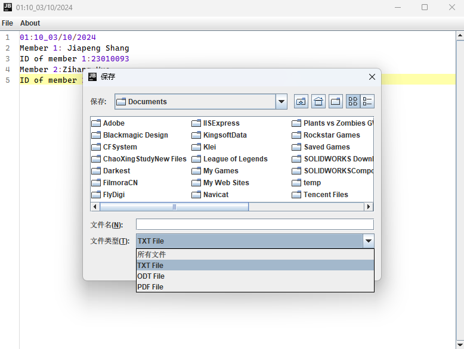

npm:`https://www.npmjs.com/package/hampad`

github:`https://github.com/hamhuo-hub/hampad.git`

For windows users

open jar File, all needed dependecies have included.

For Linux Users

# IMPORTANT
# RUN FOLLOW COMMAND TO ALLOW X11 CONNECTION： 
# xhost + 
# THEN OPEN CONTAINER： 
# docker run -e DISPLAY=$DISPLAY -v /tmp/.X11-unix:/tmp/.X11-unix -d hampad


## Download link:

github: ` https://github.com/JiaPengShang/251-Assignment1-2024-Jiapeng-Zihang.git    `


## Member information：

```
1. Name: Jiapeng Shang
   ID: 23010093
2. Name: Zihang Huo
   ID: 23009977
```


## Introduction to the Program：

### The main window of the text editor:


### A main menu---"file":


### Function 1---"new file"
When you create a new file, you can edit it directly in the window.


When a user is editing something and wants to create a new file, the program will first tell him if he wants to save what he is currently editing.
As follows:


### Function 2---"open file"


The interface of "open file":


When the user is in the middle of editing something and opens a different file, the program will first tell him if he wants to save what he is currently editing.
As follows:


### Function 3---"save file"


The interface of "save file":


Users can save content in three formats (.txt, .pdf, .odt):




### Function 4---"Search"


The interface of "search":


The searched word is highlighted.


### Function 5---"Print"


The interface of "print":


### Function 6---"Exit"

When the user clicks "Exit without save", the program exits without any further operations.


### Other Fuctions---"Copy", "Paste","Undo", "Delete", "Cut", "Select All", etc

"Copy ", "Paste", "Undo", "Delete", "Cut" and other operations need to be triggered by clicking the right mouse button.


Here are the shortcuts for these actions:

1.Copy:  `Ctrl+C`

2.Paste:  `Ctrl+V`

3.Undo:  `Ctrl+Z`

4.Select All:  `Ctrl+A`

5.Cut:  `Ctrl+X`

6.Delete:  `Del`